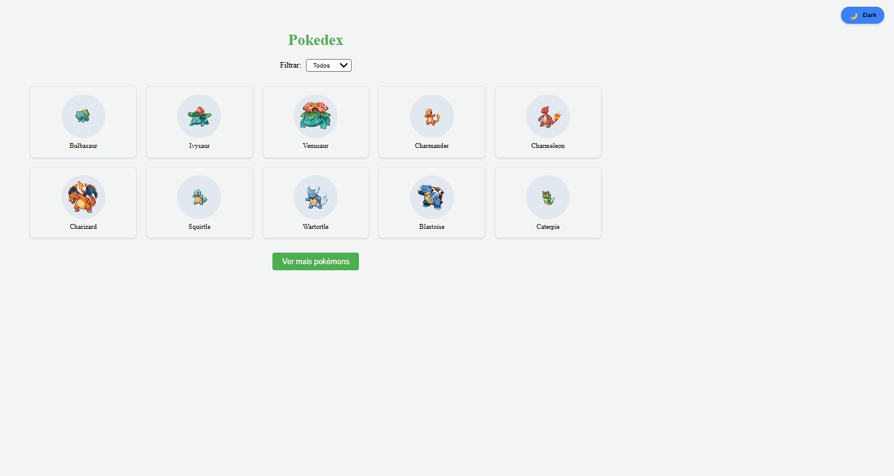

# Pokédex React App


## Descrição

Uma aplicação React que consome a PokeAPI para exibir informações sobre Pokémon, com suporte a temas claro e escuro.

## ✨ Funcionalidades

- 🌗 **Temas Dark/Light** com persistência de preferência
- 🖼️ Visualização em grid de Pokémon com paginação
- 🔍 Página de detalhes com informações completas
- 📱 Design totalmente responsivo
- ⚡ Carregamento otimizado com cache
- � Estilos dinâmicos baseados no tema

## 🚀 Tecnologias utilizadas

- **Frontend:**
  - React.js
  - React Router
  - Styled Components
  - Context API
  - React Hooks
  - CSS Variables

- **Ferramentas:**
  - Vite (ferramenta de build)
  - Axios
  - ESLint
  - Prettier

- **API:**
  - PokeAPI (fonte de dados)

## 📁 Estrutura do Projeto

```
pokedex/
├── src/
│   ├── components/
│   │   ├── pokemon-card/
│   │   │   └── pokemon-card.jsx
│   │   └── theme-toggle/
│   │       └── theme-toggle.jsx
│   │
│   ├── contexts/
│   │   └── theme-context.jsx
│   │
│   ├── pages/
│   │   ├── home.jsx
│   │   ├── pokemon-detail.jsx
│   │   └── routes.jsx
│   │
│   ├── services/
│   │   └── api.jsx
│   │
│   ├── styles/
│   │   ├── global-styles.jsx
│   │   └── theme.jsx
│   │
│   ├── App.css
│   ├── App.jsx
│   └── main.jsx
│
```
## ▶️ Como rodar o projeto  

1. **Clone o repositório:**  
   ```bash
   git clone https://github.com/alanborgesdev/pokedex
   ```
2. **Acesse a pasta do projeto:**  
   ```bash
   cd pokedex
   ```
3. **Instale as dependências:**  
   ```bash
   npm install
   ```
4. **Inicie o servidor de desenvolvimento:**  
   ```bash
   npm run dev
   ```
5. **Abra no navegador:**  
   O projeto estará rodando em: `http://localhost:3000`

## 📸 Screenshot




## 💎 Autor

Criado por **[Alan Borges](https://github.com/alanborgesdev)** 🚀

## 📝 Licença

O código-fonte deste projeto está sob a licença MIT.
